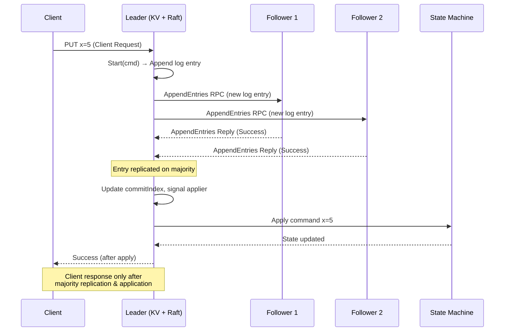
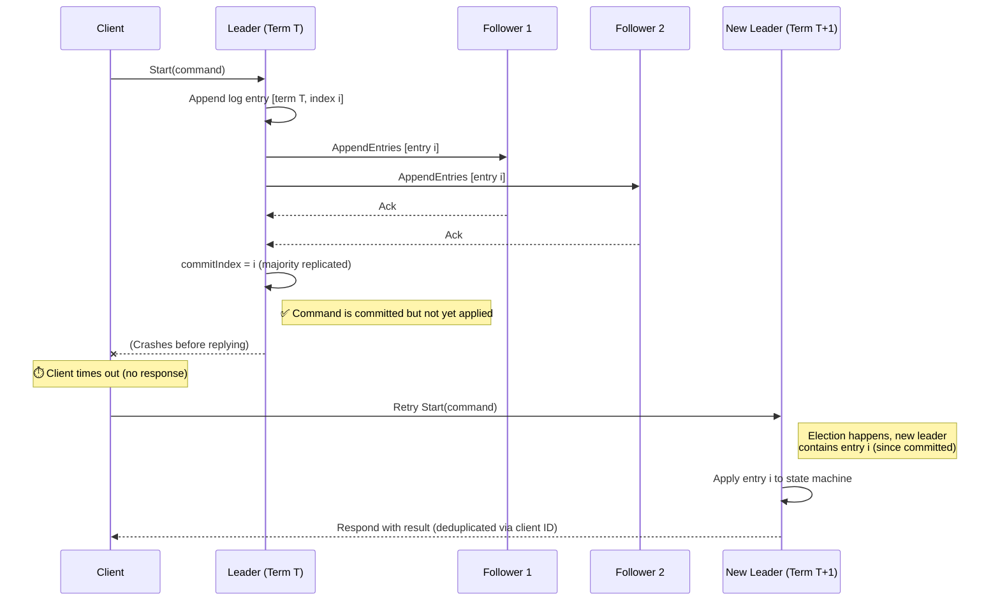

We [previously discussed]() replicated state machines, leader election in the RAFT consensus algorithm, and log-based state maintenance. Now, we'll focus on log replication across peer servers. We'll also examine how RAFT ensures that the same commands are applied to the state machine at a given log index on every peer, because of the leader's one-way log distribution to followers.

## Leader Initialisation
Once a candidate becomes leader we call `setupLeader` function which initiates go routine for each peer in the RAFT cluster, Each go routine of respective peer is responsible for replicating new log entries or sending heartbeat via `AppendEntries`  RPC.
```golang
func (rf *Raft) setupLeader() {
	rf.mu.Lock()
	defer rf.mu.Unlock()

	ctx, cancel := context.WithCancel(context.Background())
	rf.leaderCancelFunc = cancel

	for peerIndex := range rf.peers {
		if peerIndex != rf.me {
			rf.nextIndex[peerIndex] = len(rf.log) + rf.snapshotLastLogIndex
			go rf.replicate(peerIndex, ctx)
		}
	}

	go func() {
		for !rf.killed() {
			select {
			case <-ctx.Done():
				return
			case <-time.After(HEARTBEAT_TIMEOUT):
				rf.replicatorCond.Broadcast()
			}
		}
	}()
}
```

When starting a replication logic thread for each peer, we also send a Go context to `rf.replicate`. This context shows the current leader's status. If the leader steps down, we call `rf.leaderCancelFunc`, which cancels the context. When a context is canceled, the `ctx.Done()` channel closes, stopping any waiting for results from that channel. More information about Go's context can be found [here](https://pkg.go.dev/context).
Our RAFT struct includes a condition variable, `replicatorCond` (of type `*sync.Cond`), that signals all peer goroutines of the leader to run the replication logic every `HEARTBEAT_TIMEOUT`. This ensures that a heartbeat is sent to each peer at the specified interval.
A condition variable provides functions like `Wait`, `Signal`, and `Broadcast`. If multiple threads are waiting on a condition variable after releasing the underlying mutex, `Signal` will wake one of such waiting threads, and `Broadcast` will wake all waiting threads. Here we are using `Broadcast` to wake all waiting threads of each peer to send the next heartbeat. A condition variable is an operating system concept, and you can read more about the same from [here](https://pages.cs.wisc.edu/~remzi/OSTEP/threads-cv.pdf). To read about the API of Go's of type `*sync.Cond`, check Go's official Docs [here](https://pkg.go.dev/sync#Cond).

## Log Replication
Each individual peer thread runs the replicate method, given below is implementation of `rf.replicate` function

```golang
func (rf *Raft) replicate(peerIndex int, ctx context.Context) {
	logMismatch := false
	for !rf.killed() {
		select {
		case <-ctx.Done():
			dprintf("[leader-replicate: %d | peer: %d]: Leader stepped down from leadership before initiating replicate.\n", rf.me, peerIndex)
			return
		default:
			rf.mu.Lock()

			if rf.state != StateLeader {
				dprintf("[leader-replicate: %d | peer: %d]: Not a leader anymore, winding up my leadership setup.\n", rf.me, peerIndex)
				if rf.leaderCancelFunc != nil {
					rf.leaderCancelFunc()
					rf.replicatorCond.Broadcast()
				}
				rf.mu.Unlock()
				return
			}

			// Only waiting when:
			// - There is no log to send - In this case the wait will be signalled by the heartbeat
			// - We are in a continuous loop to find correct nextIndex for this peer with retrial RPCs
			if !logMismatch && rf.nextIndex[peerIndex] >= len(rf.log)+rf.snapshotLastLogIndex {
				dprintf("[leader-replicate: %d | peer: %d]: Wating for next signal to replicate.\n", rf.me, peerIndex)
				rf.replicatorCond.Wait()
			}

			if rf.killed() {
				return
			}

			reply := &AppendEntriesReply{}
			logStartIndex := rf.nextIndex[peerIndex]
			var prevLogTerm int
			prevLogIndex := logStartIndex - 1
			peer := rf.peers[peerIndex]

			if prevLogIndex-rf.snapshotLastLogIndex > 0 {
				prevLogTerm = rf.log[prevLogIndex-rf.snapshotLastLogIndex].Term
			} else if prevLogIndex == rf.snapshotLastLogIndex {
				prevLogTerm = rf.snapshotLastLogTerm
			} else {
				// prevLogIndex < rf.snapshotLastLogIndex
				prevLogTerm = -1
			}

			if prevLogTerm == -1 {
				logMismatch = true
				// Leader does not have logs at `prevLogIndex` because of compaction
				// Leader needs to send snaphot to the peer as part of log repairing
				args := &InstallSnapshotArgs{
					Term:              rf.currentTerm,
					LeaderId:          rf.me,
					LastIncludedIndex: rf.snapshotLastLogIndex,
					LastIncludedTerm:  rf.snapshotLastLogTerm,
					Data:              rf.persister.ReadSnapshot(),
				}

				reply := &InstallSnapshotReply{}

				dprintf("[leader-install-snapshot: %d: peer: %d]: InstallSnapshot RPC with index: %d and term: %d sent.\n", rf.me, peerIndex, args.LastIncludedIndex, args.LastIncludedTerm)
				rf.mu.Unlock()

				ok := rf.sendRPCWithTimeout(ctx, peer, peerIndex, "InstallSnapshot", args, reply)

				rf.mu.Lock()

				if ok {
					if reply.Term > rf.currentTerm {
						dprintf("[leader-install-snapshot: %d: peer: %d]: Stepping down from leadership, Received InstallSnapshot reply from peer %d, with term %d > %d - my term\n", rf.me, peerIndex, peerIndex, reply.Term, rf.currentTerm)

						rf.state = StateFollower
						rf.currentTerm = reply.Term
						rf.lastContactFromLeader = time.Now()

						if rf.leaderCancelFunc != nil {
							rf.leaderCancelFunc()
							rf.replicatorCond.Broadcast()
						}
						rf.persist(nil)
						rf.mu.Unlock()
						return
					}

					dprintf("[leader-install-snapshot: %d: peer: %d]: Snapshot installed successfully\n", rf.me, peerIndex)
					rf.nextIndex[peerIndex] = rf.snapshotLastLogIndex + 1
					rf.mu.Unlock()
					continue
				} else {
					dprintf("[leader-install-snapshot: %d: peer: %d]: Snapshot installtion failed!\n", rf.me, peerIndex)
					rf.nextIndex[peerIndex] = rf.snapshotLastLogIndex
					rf.mu.Unlock()
					continue
				}
			} else {
				replicateTerm := rf.currentTerm

				logEndIndex := len(rf.log) + rf.snapshotLastLogIndex
				nLogs := logEndIndex - logStartIndex

				args := &AppendEntriesArgs{
					Term:         rf.currentTerm,
					LeaderId:     rf.me,
					PrevLogIndex: prevLogIndex,
					PrevLogTerm:  prevLogTerm,
					LeaderCommit: rf.commitIndex,
				}

				if nLogs > 0 {
					entriesToSend := rf.log[logStartIndex-rf.snapshotLastLogIndex:]
					args.Entries = make([]LogEntry, len(entriesToSend))
					copy(args.Entries, entriesToSend)
					dprintf("[leader-replicate: %d | peer: %d]: Sending AppendEntries RPC in term %d with log index range [%d, %d).\n", rf.me, peerIndex, replicateTerm, logStartIndex, logEndIndex)
				} else {
					dprintf("[leader-replicate: %d | peer: %d]: Sending AppendEntries Heartbeat RPC for term %d.\n", rf.me, peerIndex, replicateTerm)
				}

				rf.mu.Unlock()
				ok := rf.sendRPCWithTimeout(ctx, peer, peerIndex, "AppendEntries", args, reply)

				rf.mu.Lock()

				if ok {
					select {
					case <-ctx.Done():
						dprintf("[leader-replicate: %d | peer: %d]: Leader stepped down from leadership after sending AppendEntries RPC.\n", rf.me, peerIndex)
						rf.mu.Unlock()
						return
					default:
						// Check fot change in state during the RPC call
						if rf.currentTerm != replicateTerm || rf.state != StateLeader {
							// Leader already stepped down
							dprintf("[leader-replicate: %d | peer: %d]: Checked ladership state after getting AppendEntries Reply, Not a leader anymore, Winding up my leadership setup.\n", rf.me, peerIndex)
							if rf.leaderCancelFunc != nil {
								rf.leaderCancelFunc()
								rf.replicatorCond.Broadcast()
							}
							rf.mu.Unlock()
							return
						}

						// Handle Heartbeat response
						if !reply.Success {
							if reply.Term > rf.currentTerm {
								dprintf("[leader-replicate: %d: peer: %d]: Stepping down from leadership, Received ApppendEntries reply from peer %d, with term %d > %d - my term\n", rf.me, peerIndex, peerIndex, reply.Term, rf.currentTerm)

								rf.state = StateFollower
								rf.currentTerm = reply.Term
								rf.lastContactFromLeader = time.Now()

								if rf.leaderCancelFunc != nil {
									rf.leaderCancelFunc()
									rf.replicatorCond.Broadcast()
								}
								rf.persist(nil)
								rf.mu.Unlock()
								return
							}

							// Follower rejected the AppendEntries RPC beacuse of log conflict
							// Update the nextIndex for this follower
							logMismatch = true
							followersConflictTermPresent := false
							if reply.ConflictTerm != -1 {
								for i := prevLogIndex - rf.snapshotLastLogIndex; i > 0; i-- {
									if rf.log[i].Term == reply.ConflictTerm {
										rf.nextIndex[peerIndex] = i + 1 + rf.snapshotLastLogIndex
										followersConflictTermPresent = true
										break
									}

								}

								if !followersConflictTermPresent {
									rf.nextIndex[peerIndex] = reply.ConflictIndex
								}
							} else {
								rf.nextIndex[peerIndex] = reply.ConflictIndex
							}
							dprintf("[leader-replicate: %d | peer: %d]: Logmismatch - AppendEntries RPC with previous log index %d of previous log term %d failed. Retrying with log index:%d.\n", rf.me, peerIndex, prevLogIndex, prevLogTerm, rf.nextIndex[peerIndex])
							rf.mu.Unlock()
							continue
						} else {
							dprintf("[leader-replicate: %d | peer: %d]: responded success to AppendEntries RPC in term %d with log index range [%d, %d).\n", rf.me, peerIndex, replicateTerm, logStartIndex, logEndIndex)
							logMismatch = false

							if nLogs > 0 {
								// Log replication successful
								rf.nextIndex[peerIndex] = prevLogIndex + nLogs + 1
								rf.matchIndex[peerIndex] = prevLogIndex + nLogs

								// Need to track majority replication upto latest log index
								// - So that we can update commitIndex
								// - Apply logs upto commitIndex
								// Just an idea - maybe this needs to be done separately in a goroutine
								// Where we continuosly check lastApplied and commitIndex
								// Apply and lastApplied to commit index and if leader send the response to apply channel
								majority := len(rf.peers)/2 + 1

								for i := len(rf.log) - 1; i > rf.commitIndex-rf.snapshotLastLogIndex; i-- {
									matchedPeerCount := 1
									if rf.log[i].Term == rf.currentTerm {
										for pi := range rf.peers {
											if pi != rf.me && rf.matchIndex[pi] >= i+rf.snapshotLastLogIndex {
												matchedPeerCount++
											}
										}
									}

									// Largest possible log index greater the commitIndex replicated at majority of peers
									// update commitIndex
									if matchedPeerCount >= majority {
										rf.commitIndex = i + rf.snapshotLastLogIndex

										dprintf("[leader-replicate: %d | peer: %d]: Log index %d replicated to majority of peers.(%d/%d peers), updating commitIndex to : %d, current lastApplied value: %d.\n", rf.me, peerIndex, i+rf.snapshotLastLogIndex, matchedPeerCount, len(rf.peers), rf.commitIndex, rf.lastApplied)
										rf.applyCond.Signal()
										break
									}
								}
							}

							rf.mu.Unlock()
							continue
						}
					}
				}
				dprintf("[leader-replicate: %d | peer %d]: Sending AppendEntries RPC at leader's term: %d, failed. Payload prevLogIndex: %d | prevLogTerm: %d.\n", rf.me, peerIndex, replicateTerm, prevLogIndex, prevLogTerm)
				rf.mu.Unlock()
				continue
			}
		}
	}
}
```

The `replicate` function operates in a continuous loop. Inside this loop, a `select` statement monitors the leader's context (`ctx`) status. If `ctx.Done()` is not yet closed, it confirms the current server is still the leader. To ensure correctness, the server's current state is also checked to be `StateLeader`. If it's not, `rf.leaderCanelFunc` is explicitly called to relinquish leadership, which closes the context's done channel, signalling the leader's relinquishment to other components. Additionally, the loop waits on `rf.replicatorCond` when there are no more logs to transmit and no log mismatch between the leader's and the peer's logs.
As mentioned in [Part 1 of this blog series](), servers periodically compact their logs to manage their size. This involves taking a snapshot of the current state and then truncating the log up to that point. If a follower's log is significantly behind the leader's and the leader has already truncated its log, the leader may need to send a snapshot using the `InstallSnapshot` RPC. We will delve deeper into log compaction in a later part of this series.
Leader maintains volatile state for each peer `nextIndex` and `matchIndex`, these two properties for each peer are maintained by the leader, and it tells the leader which next log index to send to the peer and index up to which logs are replicated for that peer respectively.

### Heartbeat rules
The `AppendEntries` RPC also functions as a heartbeat, allowing the leader to communicate its identity and log status to all followers. A follower only accepts this RPC if:
- The leader's `Term` value is greater than or equal to the follower's current term. If not, the follower rejects the RPC, signalling that the sender (mistakenly believing itself to be the leader) is outdated. The follower sends its own `reply.Term` to indicate this. Upon receiving a `Term` in the reply that is higher than its own, the leader relinquishes leadership.
- The leader includes `PrevLogIndex` and `PrevLogTerm` with each `AppendEntries` RPC. These values are vital, as they indicate the leader's log state by specifying the index and term of the log up to which the leader believes the follower's log matches. If there is a discrepancy, the follower responds with `reply.Success` set to false, indicating a log mismatch. The leader then decreases `nextIndex[peerIndex]` for that peer and sends another heartbeat with an earlier log index. This process continues until a matching log index is found. At that point, the follower accepts the leader's `AppendEntries` RPC and uses the `reconcileLogs` function to remove conflicting log entries and replace them with the log range sent by the leader from `[PrevLogIndex + 1, LatestLogIndexAtLeader]`. extracted from `args,Entries` field.
  This RAFT property is followed by each index of the follower, so if the current index and term match with the leader, so does the log index previous to this one, or else a conflict would have occurred previously itself. **So this single property ensures that the log state matches between leader and follower up to the latest index;** otherwise, the follower will not accept the heartbeat or normal `AppendEntries` RPC with log entries, *and the to-and-fro of heartbeats after that to find the non-conflict index at the follower is called the log correction process.* Later on, we will see how we can optimise this log correction because currently the leader needs to try for each log index in decreasing order, which can take a lot of time if the follower has been stale for a long time and during that time the leader's log has grown a lot.


The image above, shows a simple successful log replication situation. Here, Follower 1 and Follower 2 have the same initial part of the log as the leader. Also, the leader knows exactly which parts of the log need to be sent to each follower.

In the `replicate` method, we use a `logMismatch` flag within the replication loop. This flag shows if there was a log problem when sending the `AppendEntries` RPC in the last loop. If there was a problem, we don't wait (we don't call `rf.replicatorCond.Wait()`, which releases the lock and puts the thread to sleep). This is because, if there's a log problem, we want to fix the log quickly, so we send the next `AppendEntries` RPC right away with the updated previous log index and term.
If the previous log index is less than the index up to which we've taken a snapshot of the state and shortened the log, we send an `InstallSnapshot` RPC to send the snapshot to the follower instead, since we don't have the needed logs. We'll discuss snapshots and log compaction more later.
We still follow one rule closely: if we get an RPC reply with a term value higher than the leader's current term, the leader gives up leadership by cancelling the context. See the [previous part]() for more information.

In the image, follower 1's `nextIndex` is at index `7`. When an `AppendEntries` RPC is sent with `prevLogIndex=6` and `prevLogTerm=2`, the follower detects a log mismatch and rejects the RPC. Because the follower's term is also `2`, the leader keeps its leadership role and immediately reduces its `nextIndex` for follower 1 to `6`. It then sends another `AppendEntries` RPC (without waiting due to `logMismatch=true`) with `prevLogIndex=5` and `prevLogTerm=2`. This second RPC is accepted. The leader sends `Entries=[1, 2]`, causing the entries after index 5 to be replaced by these new entries (handled by ). **Thus, the leader can erase uncommitted entries from the follower during log correction.**
Follower 2 accepts the initial `AppendEntries` RPC because there is no conflict. **Since The leader manages each peer in its own separate goroutine**, After each successful RPC response, the leader checks if a majority (replication factor) has replicated the log up to a specific index. In this scenario, once follower 2 responds (likely before follower 1, which is still correcting its log), the leader will have replicated log `index 7 on 2/3` of the peers (including itself). 

The leader then updates its `commitIndex` and signals a condition variable called `rf.applyCond`. First, we will examine how the follower handles the `AppendEntries` RPC.  Then, building on this understanding, we will discuss `commitIndex`, `lastApplied`, and` rf.applyCond`, explaining how they ensure log entries are committed, what "committed" means, what "applying" a log means, and how it is handled."

### Handling `AppendEntries` RPC 
Lets now look at how a `Follower` handles an `AppendEntries` RPC from a leader, we will revisit leader's `replicate` method when we get to how logs are committed and applied to the state machine by the leader and how this change is propagated to followers.
Given below is the implementation of `AppendEntries` RPC:
```go
func (rf *Raft) AppendEntries(args *AppendEntriesArgs, reply *AppendEntriesReply) {
	// Handling heart beats from leader
	// When follower recieves heartbeat it should check for heartbeat validity

	// [Case: 1] if args.Term < rf.currentTerm then it means this follower is either a new leader
	// OR it voted for someone else after least heartbeat.
	// In such case follower should return reply.Success = false indicating it does not acknowledge the sender
	// as leader anymore and should set reply.Term = rf.currentTerm. (This indicated sender to step down from leadership)

	// [Case: 2] if args.Term >= rf.currentTerm the the current follower/candidate becomes follower again accepting current leader
	// In such case rf.currentTerm = args.Term and reply.Success = true with reply.Term = rf.currentTerm (same term as the sender)
	// In Case 2 we should reset the election timer since we have received the heartbeat from a genuine leader

	// In Case 1 since the previous leader is now left behind, there are 3 possibilities:
	// 		A. The current peer is a candidate now and an election was already started by it or even finished with it being the current leader
	// 		B. Some other peer is now a candidate with an election going on OR is a leader now
	// 		C. No election has taken place till now
	// In all the above cases we should not interrupt the election timeout or anything else

	rf.mu.Lock()
	defer rf.mu.Unlock()

	if len(args.Entries) == 0 {
		// Heartbeat
		dprintf("[Peer: %d]: Recieved AppendEntries RPC as heartbeat from leader %d for term %d with commitIndex %d.\n", rf.me, args.LeaderId, args.Term, args.LeaderCommit)
	}

	if args.Term < rf.currentTerm {
		dprintf("[Peer: %d]: AppendEntries RPC from leader %d for term %d not acknowledged, Leader's term: %d is older than my current term: %d.\n", rf.me, args.LeaderId, args.Term, args.Term, rf.currentTerm)
		reply.Success = false
		reply.Term = rf.currentTerm

		return
	} else {
		// Sent by current leader
		// Reset election timeout
		if rf.state == StateLeader {
			dprintf("[Peer: %d]: AppendEntries RPC recieved from current leader: %d, winding up my leadership setup.\n", rf.me, args.LeaderId)
			if rf.leaderCancelFunc != nil {
				rf.leaderCancelFunc()
				rf.replicatorCond.Broadcast()
			}
		}

		rf.lastContactFromLeader = time.Now()

		rf.currentTerm = args.Term
		rf.state = StateFollower

		rf.persist(nil)

		latestLogIndex := len(rf.log) - 1
		logTerm := 0

		if args.PrevLogIndex > rf.snapshotLastLogIndex && args.PrevLogIndex <= latestLogIndex+rf.snapshotLastLogIndex {
			logTerm = rf.log[args.PrevLogIndex-rf.snapshotLastLogIndex].Term
		} else if args.PrevLogIndex == rf.snapshotLastLogIndex {
			logTerm = rf.snapshotLastLogTerm
		} else if args.PrevLogIndex < rf.snapshotLastLogIndex {
			// This should trigger InstallSnapshot from leader
			reply.ConflictIndex = rf.snapshotLastLogIndex + 1
			reply.ConflictTerm = -1
		}

		if logTerm != args.PrevLogTerm {
			dprintf("[Peer: %d]: AppendEntries RPC from leader %d for term %d not acknowledged. Log terms do not match, (Leader term, Leader index): (%d, %d), peer's term for same log index: %d.\n", rf.me, args.LeaderId, args.Term, args.PrevLogTerm, args.PrevLogIndex, logTerm)
			reply.Success = false
			reply.Term = rf.currentTerm

			if args.PrevLogIndex <= latestLogIndex+rf.snapshotLastLogIndex {
				reply.ConflictTerm = logTerm
				i := args.PrevLogIndex - rf.snapshotLastLogIndex
				// Find fist index of `logTerm` in follower's log
				for ; i > 0; i-- {
					if rf.log[i].Term != logTerm {
						break
					}
				}

				reply.ConflictIndex = i + 1 + rf.snapshotLastLogIndex
			}

			return
		}

		reply.Success = true
		reply.Term = rf.currentTerm

		dprintf("[Peer: %d]: AppendEntries RPC from leader %d for term %d acknowledged.\n", rf.me, args.LeaderId, args.Term)

		if len(args.Entries) > 0 {
			rf.reconcileLogs(args.Entries, args.PrevLogIndex)
		}

		if args.LeaderCommit > rf.commitIndex {
			// If leaderCommit > commitIndex, set commitIndex =
			// min(leaderCommit, index of last new entry)

			rf.commitIndex = args.LeaderCommit

			if args.LeaderCommit >= len(rf.log)+rf.snapshotLastLogIndex {
				rf.commitIndex = len(rf.log) - 1 + rf.snapshotLastLogIndex
			}

			dprintf("[Peer: %d]: Updated commmit index to %d.\n", rf.me, rf.commitIndex)

			rf.applyCond.Signal()
		}
	}

}
```
Like other Remote Procedure Calls, we initially verify if the sender's `args.Term` is lower than the recipient's term. If it is, we reject the call, notifying the sending leader that its leadership is outdated and the cluster's `term` has advanced since it was last the leader. We include the term value in the response, prompting the sender to relinquish leadership and begin synchronizing. As mentioned before, this synchronization occurs when the peer receives a heartbeat from the current leader, initiating any necessary log corrections. This demonstrates that log flow consistently originates from the current leader to all other followers.
The same principle applies if the receiving peer believes itself to be the leader of a term less than or equal to the term in the `AppendEntries` RPC. In this scenario, we acknowledge the sender as the rightful current leader and invoke `rf.leaderCancelFunc()` to force the current peer to step down from leadership. Additionally, we broadcast on `rf.replicatorCond` to ensure that all peer-specific replication threads spawned by this receiver recognize the effect of the cancelled context as quickly as possible.
After confirming the leader's identity, we begin by updating the `lastContactFromLeader` timestamp. Each follower has a `ticker` that verifies if the last communication from the leader exceeded a set threshold (the election timeout). If it does, the follower can become a candidate and initiate an election. Updating the timestamp prevents unnecessary elections. More information about leader election can be found in the [preceding section]().
After this We move on to verifying **log consistency**. This is done using the `PrevLogIndex` and `PrevLogTerm` fields of the `AppendEntries` RPC.
The follower checks if it has a log entry at `PrevLogIndex` and whether that entry’s term matches `PrevLogTerm`. If either of these checks fail, it indicates that the follower’s log has diverged from the leader’s. In such cases, the follower rejects the RPC by returning `Success = false`. This rejection signals to the leader that it needs to adjust its `nextIndex` for this follower and retry from an earlier point in its log, Effectively “backing up” until it finds the last matching entry.
Now, without any optimization, this correction process could be quite inefficient: the leader would decrement `nextIndex[peer]` one step at a time and re-send the RPC repeatedly until it finds a match. If the follower has fallen far behind (say, by _N_ entries), this would take _N_ separate RPCs:  a linear-time process that can become costly in large logs.
To avoid that, Raft introduces a **log inconsistency optimization**. Instead of merely rejecting the RPC, the follower includes two additional fields in its response: `ConflictTerm` and `ConflictIndex`. These tell the leader the term of the conflicting entry and the first index where that term begins.
With this information, the leader can skip behind intelligently. It looks for the last entry in its own log with the same `ConflictTerm`.
- If it finds one, it sets the follower’s `nextIndex` to just after that entry: meaning it assumes both logs agree up to that point, This assumption may fail when the `AppendEntries` is again rejected with backed up `nextIndex` value which means the followers log are lagging behind leader's term at that index, so leader will repeat this process again with new `ConflictIndex` and `ConflictTerm`
- If it doesn’t find any entry with that term, it sets `nextIndex` to `ConflictIndex`, effectively jumping back to where the follower’s conflicting term started.
This optimization allows the leader to perform correction **per term**, rather than **per index**, drastically reducing the number of RPCs needed for log repair, especially when followers lag by many entries. You can check the code for `replicate` method above (especially when the `res.Success` is set to false with `res.Term <= leader.currentTerm)` to check the above behaviour of leader during log conflict.
Once a consistent prefix is identified, the follower can safely append new entries included in the RPC. In the implementation, this is handled by the `reconcileLogs` method, which takes the leader’s entries and merges them into the follower’s log while ensuring term consistency.
```go
func (rf *Raft) reconcileLogs(leaderEntries []LogEntry, leaderPrevLogIndex int) {
	nextIndex := leaderPrevLogIndex + 1
	currentLogLength := len(rf.log) + rf.snapshotLastLogIndex
	leaderEntriesIndex := 0

	for nextIndex < currentLogLength && leaderEntriesIndex < len(leaderEntries) {
		if rf.log[nextIndex-rf.snapshotLastLogIndex].Term != leaderEntries[leaderEntriesIndex].Term {
			break
		}

		nextIndex++
		leaderEntriesIndex++
	}

	if leaderEntriesIndex < len(leaderEntries) {
		// If an existing entry conflicts with a new one (same index but different terms), delete the existing entry and all that follow it
		rf.log = rf.log[:nextIndex-rf.snapshotLastLogIndex]

		//  Append any new entries not already in the log
		rf.log = append(rf.log, leaderEntries[leaderEntriesIndex:]...)

		rf.persist(nil)
	}

	dprintf("[Peer %d]: Reconciled logs with leader from index %d, current logs length %d.\n", rf.me, leaderPrevLogIndex, len(rf.log)+rf.snapshotLastLogIndex)
}
```
This function essentially performs the final step of **log reconciliation** after the agreement point between leader and follower has been established.
- It starts from the index immediately after `leaderPrevLogIndex`:  the point up to which both leader and follower agree.
- Then it walks through both logs in parallel, comparing terms for each entry.
- As soon as it finds a mismatch (a conflict in term at the same index), it stops:  that’s where the logs diverge.
- From that point onward, it truncates the follower’s log (`rf.log = rf.log[:nextIndex - rf.snapshotLastLogIndex]`) and appends all remaining entries from the leader’s log.

This effectively overwrites any inconsistent or “stale” entries on the follower with the authoritative entries from the leader, restoring complete log alignment.
So, `reconcileLogs` is the place where the follower’s log is **actually modified**. It’s where the “*diff*” from the leader is applied after the last point of agreement. Once again, this highlights the fundamental directionality of Raft’s replication flow: **log entries always move from the leader to the followers**, never the other way around.
## Committing and Applying Log Entries
If a leader receives successful `AppendEntries` RPC responses from a majority of followers, it indicates that the logs of a majority of peers match the leader's up to a specific index. Because agreement on a current log index implies agreement on all preceding indices, the leader can confidently assert that the logs match **up to** that given index. Consequently, the leader will then designate that index as the commit index.
```go
for i := len(rf.log) - 1; i > rf.commitIndex-rf.snapshotLastLogIndex; i-- {
	matchedPeerCount := 1
	if rf.log[i].Term == rf.currentTerm {
		for pi := range rf.peers {
			if pi != rf.me && rf.matchIndex[pi] >= i+rf.snapshotLastLogIndex {
				matchedPeerCount++
			}
		}
	}

	// Largest possible log index greater the commitIndex replicated at majority of peers
	// update commitIndex
	if matchedPeerCount >= majority {
		rf.commitIndex = i + rf.snapshotLastLogIndex

		dprintf("[leader-replicate: %d | peer: %d]: Log index %d replicated to majority of peers.(%d/%d peers), updating commitIndex to : %d, current lastApplied value: %d.\n", rf.me, peerIndex, i+rf.snapshotLastLogIndex, matchedPeerCount, len(rf.peers), rf.commitIndex, rf.lastApplied)
		rf.applyCond.Signal()
		break
	}
}
```
This is evident at the end of the `replicate` method. After obtaining a success response for each peer-specific thread, the method verifies the `matchIndex` for all peers. Similar to `nextIndex`, each leader maintains a `matchIndex` for each peer. This `matchIndex` essentially signifies the index up to which the peer's log matches the leader's, or, in other words, the extent to which the leader's log has been replicated to that follower.
As you can see if a new log entry has been replicated to majority, We also signal on `applyCond` condition variable. 
Upon starting, each peer launches both a `ticker` go routine and an `applier` go routine. The `applier`'s function is to retrieve logs **from the `lastAppliedIndex` (the point of the last application) up to the most recent commit index** and execute each command on the state machine. In this setup, every Raft server instance receives an `apply` channel at startup, provided by the service utilizing RAFT. In our key-value server example, commands from log entries sent to the `apply` channel are processed by the KV server, which then executes them.
```go
func (rf *Raft) applier() {
	for !rf.killed() {
		rf.mu.Lock()
		for rf.lastApplied >= rf.commitIndex {
			rf.applyCond.Wait()
		}

		if rf.killed() {
			return
		}

		i := rf.lastApplied + 1
		if i < rf.snapshotLastLogIndex+1 {
			i = rf.snapshotLastLogIndex + 1
		}

		messages := make([]raftapi.ApplyMsg, 0)
		for ; i <= rf.commitIndex; i++ {
			// Skip entries that are already in the snapshot
			if i <= rf.snapshotLastLogIndex {
				continue
			}
			msg := raftapi.ApplyMsg{
				CommandValid: true,
				Command:      rf.log[i-rf.snapshotLastLogIndex].Command,
				CommandIndex: i,
			}
			messages = append(messages, msg)
		}
		commitIndex := rf.commitIndex
		rf.mu.Unlock()

		for _, msg := range messages {
			if rf.killed() {
				return
			}
			rf.applyCh <- msg
		}

		rf.mu.Lock()
		rf.lastApplied = commitIndex
		dprintf("[Peer: %d]: Applied logs till latest commit index: %d, lastApplied : %d.\n", rf.me, rf.lastApplied, rf.commitIndex)
		rf.mu.Unlock()
	}
}
```
> While sending something to a Go channel, the channel itself can work concurrently with multiple threads pushing data from it. So, we do not need the `rf.mu` lock while sending commands, which can be a blocking operation. In a non-buffered channel, an inserted element is only accepted when there is an active consumer to consume that element. Therefore, to avoid holding the Raft server state's lock `mu`, we release the lock and only reacquire it after we have applied all the logs to log out the Raft server's state.

If the `commitIndex` is not greater than `lastAppliedIndex`, the applier thread pauses by unlocking and waiting for a signal. **When the `commitIndex` of a leader or follower changes, the applier thread is signaled to resume and apply new logs (between `lastAppliedIndex` and `commitIndex`) to the state machine.** The leader's `commitIndex` is updated upon majority replication. To ensure the replicated state of follower matches the leader's RAFT state (same `commitIndex`) and the underlying state machine's state (e.g., the KV server's state), the updated  `commitIndex` of leader is included in the next upcoming `AppendEntries` RPC heartbeat. Each follower, after agreeing with the RPC, updates its own `commitIndex` and signals its applier thread to update the state machine with the new logs received from the leader.
```go
func (rf *Raft) (args *AppendEntriesArgs, reply *AppendEntriesReply) {
// ...existing code
if args.LeaderCommit > rf.commitIndex {
			// If leaderCommit > commitIndex, set commitIndex =
			// min(leaderCommit, index of last new entry)

			rf.commitIndex = args.LeaderCommit

			if args.LeaderCommit >= len(rf.log)+rf.snapshotLastLogIndex {
				rf.commitIndex = len(rf.log) - 1 + rf.snapshotLastLogIndex
			}

			dprintf("[Peer: %d]: Updated commmit index to %d.\n", rf.me, rf.commitIndex)

			rf.applyCond.Signal()
		}
}
```

### Why Majority-Based Commitment Guarantees Safety
A critical property of Raft is that **once a log entry is committed (replicated on a majority of servers), it is guaranteed to eventually be applied to the state machine** even if the current leader crashes immediately after marking it committed.
This guarantee comes from how Raft defines _commitment_ and how election safety works together with _log matching_.
When a leader replicates a new log entry to a majority of peers and advances its `commitIndex`, it knows that *at least a majority of servers (including itself) now store that entry in their logs*. Even if the leader crashes at this point (before or after applying the entry), that entry cannot be lost, because any future leader must have that entry as well.
Here’s why: during the next election, any candidate must receive votes from a **majority** of peers to become the new leader. And followers will only vote for a candidate whose log is [**at least as up-to-date** as their own](), Meaning the candidate’s last log term and index are greater than or equal to the follower’s.
Since the previously committed entry was stored on a majority, *at least one of those peers (and in fact, at least one from that same majority)* will participate in the next election. Because votes also require a majority, any new leader must intersect with that previous majority i.e., it must share at least one server that already contained the committed entry. As a result, the new leader’s log will contain that committed entry (or a longer version of it), ensuring that **committed entries never roll back** and will always be part of future leaders’ logs.
This intersection property between consecutive majorities ensures Raft’s **log commitment safety**:
>Once a log entry is committed, it will never be overwritten or lost, It will eventually be applied to the state machine on all servers.

This reasoning also explains why it’s safe for the applier thread to apply all entries up to `commitIndex`. The guarantee that every future leader’s log contains those entries means that applying them to the state machine can never be undone, preserving Raft’s **state machine safety property**,  no server ever applies a log entry that another server later overwrites.
However, this safety holds under one important restriction, we will discuss this restriction shortly, but first lets see few scenarios with the end client in picture using a service which is replicated with RAFT.

1. **Leader replication and response to client**
   At the service layer, this guarantee extends all the way to the client. When a client issues a command to the leader (for example, a PUT request to the key-value server), the service calls the Raft instance’s `Start()` method. This appends the command as a new log entry and begins replication across peers (We signal the `replicatorCond` condition variable which resumes the `replicate` method this time with a new log entry). The `Start()` call returns immediately, but the KV service **does not** reply to the client yet, it waits until that log entry is replicated on a **majority** of servers and marked as committed. Only after the applier thread applies this entry to the state machine does the service respond to the client with success.
   This ensures that every command acknowledged to the client is backed by a majority-replicated, committed log entry, one that will survive even if the current leader crashes right after responding. Responding before commitment would be unsafe, since uncommitted entries can be discarded if the leader fails before majority replication completes.
   To visualize this flow, here’s how the end-to-end interaction between the client, leader, followers, and the KV state machine looks:


2. **Leader Crashes After Committing but Before Applying:**

- The leader had **committed** the log (i.e., replicated to majority), but before applying or responding, it **crashed**.
- The **client times out**, since no response was received.
- A new leader is elected (say, `L'`), which **must contain all committed entries** from the previous term.
- During recovery, `L'`’s applier thread applies the committed command to its state machine.
- The client retries the command.
    - If the system **uses a unique client ID + command ID**, the server can detect it’s a **duplicate request** and not reapply the command, ensuring **exactly-once semantics**.

### Why leader commits log entry when its of `currentTerm` only?
You may have noticed in the `replicate` method that when counting majority replication we start form the lastest log index at the leader and if that log's term is equal to leader's current term then only we check the replication factor for that log and update commit index and applier thread in case of majority, But why is this the case?


# References

- https://pdos.csail.mit.edu/6.824/papers/raft-extended.pdf
- Log Replication [Visualisation](https://thesecretlivesofdata.com/raft/#replication)
- https://thesquareplanet.com/blog/students-guide-to-raft/
- https://pages.cs.wisc.edu/~remzi/OSTEP/threads-cv.pdf