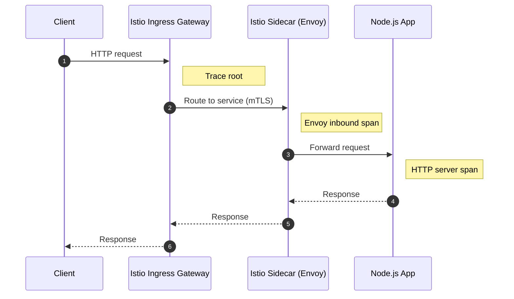
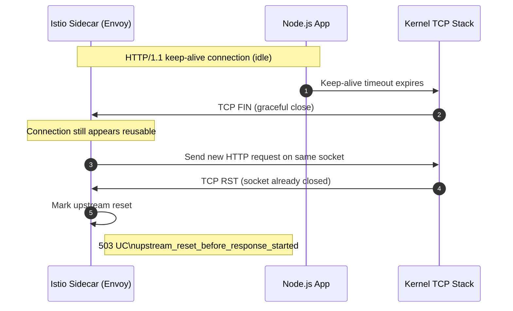
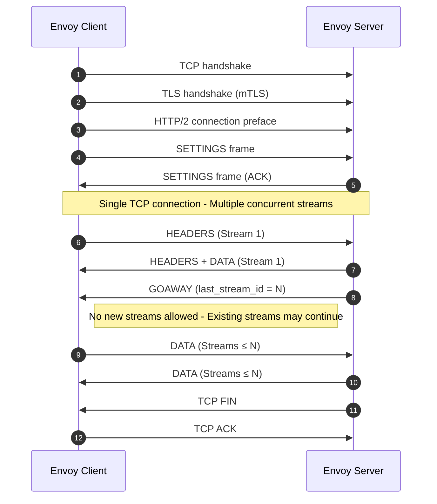

## Background 
To obtain more relevant metrics and a comprehensive understanding of traces when external API requests access our systems, We opted to enable tracing for the network mesh components situated above the Kubernetes service. This specifically covers the entire request flow from its initiation: the ingress gateway receives the request and routes it according to defined rules to a particular K8s service; then, the Istio sidecar proxy containers, running alongside our application containers in the same pod, receive and proxy the request to main containers, where our Node.js server process ultimately handle it and generate the appropriate response.
Before enabling tracing for istio mesh, tracing for a HTTP request began when the request reached our application container at the pod level, with HTTP auto-instrumentation serving as the trace root.

**Flow of an external request:**

Following this change, we gained additional spans, with the trace root now identified as the Istio ingress gateway, followed by the sidecar containers of the K8s service pod to which the request was routed, and finally the main Node.js container’s HTTP span.
The primary advantage of this approach is significantly **improved visibility into request failures occurring before the application layer**. Earlier, when issues arose within the network mesh, such as *routing failures, mTLS handshakes, or upstream connectivity problems*, we would receive alerts from the frontend indicating 5XX errors on API calls, yet observe no corresponding errors in our backend HTTP metrics. This mismatch often caused confusion, as the requests never reached our application containers, and therefore application-level instrumentation could neither record the request nor emit 5XX responses. As a result, our backend alerting was effectively blind to these failure scenarios.
This closes the observability gap by clearly identifying failures occurring before the application layer. 
Let’s look at one such issue that occurred at seemingly random intervals, making it difficult to diagnose, and how the additional observability data from the network mesh helped us identify the root cause.

## 503 UC Error
Upon configuring Grafana dashboards for several Istio metrics (sourced from [here](https://grafana.com/orgs/istio/dashboards)), we observed numerous 503 errors reported by the ingress gateway across many Kubernetes services, without any specific HTTP API endpoint being consistently implicated.


With tracing in place, we searched Grafana Tempo (our datasource for traces) using the following TraceQL query:
```
{span.http.status_code="503" && resource.service.name="istio-ingressgateway.istio-system"}
```
This allowed us to quickly identify traces corresponding to all such 5XX error cases.

As shown in the trace above, the request fails at the **Istio ingress gateway and sidecar proxy layers, and no span corresponding to the main application container (Node.js HTTP server) is present.** This indicates that the request never reached the application pod itself.
This also explains the alert mismatch observed earlier: since the failure occurred entirely within the network mesh, application-level HTTP instrumentation never recorded the request and therefore **could not emit 5XX metrics or trigger backend alerts**. With mesh-level tracing enabled, these previously invisible failures are now captured and can be correlated directly with frontend-reported errors.
Having identified the pod where the request failed, we can now query Grafana Loki, our log data source, to check whether the `istio-proxy` sidecar container recorded any logs. Since the sidecar represents the terminal point for this request within the system, its logs are the most relevant for understanding the failure. Indeed, the following log entry confirms the issue:
```logfmt
[2026-01-27T06:08:22.422Z] "GET ********* HTTP/1.1" 503 UC upstream_reset_before_response_started{connection_termination} - "-" 0 88 50 - "2401:4900:bce9:6781:a4ab:23ff:fec4:3ef4,172.69.152.151" "Mozilla/5.0 (Linux; Android 10; K) AppleWebKit/537.36 (KHTML, like Gecko) Chrome/139.0.0.0 Mobile Safari/537.36" "c1e87fc8-e7d0-9f67-8bfe-42be707c9b25" "api.xyz.com" "10.88.4.251:3000" inbound|3000|| 127.0.0.6:33183 10.88.4.251:3000 XX.XX.XX.XX:0 - default
```

The key part of the log entry is `503 UC upstream_reset_before_response_started{connection_termination}`. This indicates that when the sidecar proxy forwarded the request to the upstream service (the main application container), the upstream closed or reset the connection before any response could be sent.
Envoy interprets this as an upstream connection termination, and consequently returns a 503 error to the downstream client.
After investigating the issue and discussing it extensively, including exploring insights with LLMs, we arrived at an interesting finding that ultimately pointed to the [root cause](https://github.com/istio/istio/issues/55138#issuecomment-2666855044): the connection was being terminated by the upstream application container. Before diving into that, it is important to briefly outline the layered nature of a network request in our setup.
From the very start, a request passes through multiple entities: **The cloud load balancer, the ingress gateway inside the Kubernetes cluster, the Istio sidecar proxy, and finally the main application container.** Each of these components maintains its own set of connections and, in most cases, its own connection pools. When a new request arrives, it may reuse an existing connection or establish a new one for forwarding the request upstream. As a result, a single logical request is often carried across a chain of independent network connections before the packet reaches its final destination.
In an `Istio` service mesh, communication between proxies is secured using `mTLS` and typically happens over HTTP/2, while traffic forwarded from the sidecar to the main application container is usually downgraded to HTTP/1.1. **Each end of these connections enforces its own keep-alive and idle timeout policies, and once a connection remains idle beyond the configured threshold, it may be closed by that endpoint.** The exact network signal used to close the connection, such as a graceful close or a reset, depends on the protocol in use.
This layered connection model and protocol behaviour form an important context for understanding what we observe next.



By default, a **Node.js HTTP server enforces a keep-alive timeout of around 5 seconds**. If the connection between the Istio sidecar and the Node.js application container remains idle beyond this threshold, the Node.js process initiates a graceful shutdown of the HTTP/1.1 connection by **sending a TCP FIN**.
However, a race condition can occur if, around the same time, the sidecar forwards a new downstream request and attempts to reuse this connection. In such cases, the request is **written to a socket that has already been closed by the application**. The operating system’s TCP stack then responds **with a TCP RST**, indicating that the connection is no longer valid.
From Envoy’s perspective, this manifests as an upstream connection reset before any response headers are received. As a result, the sidecar treats this as a network-level failure and returns a `503 UC (upstream_reset_before_response_started)` error to the downstream client.

> This failure occurs in the narrow window where the upstream has already initiated a graceful connection close, but the sidecar has not yet observed the FIN and therefore attempts to reuse the same connection.

The fix for this issue is relatively straightforward: we need to ensure that *idle connections are closed by downstream components before the Node.js process in the main container initiates the close*. This prevents Envoy from reusing a connection that the application has already decided to terminate.
By default, the Istio sidecar proxy and the ingress gateway maintain upstream connections with idle timeouts of around one hour in most configurations. Reducing these timeouts to values lower than Node.js’s default 5 seconds is not a viable option, **as it would lead to excessive connection churn, increased TLS handshake overhead, and degraded performance**.
On the other hand, increasing the Node.js HTTP server’s keep-alive timeout to match Envoy’s one-hour timeout is also undesirable, since it would cause the application to retain a large number of idle connections, **potentially resulting in unnecessary memory usage and file descriptor pressure.**
In our setup, there is an additional network component upstream of the Istio ingress gateway, A cloud provider load balancer, with an idle connection timeout of 30 seconds. This effectively places a hard upper bound on how long idle downstream connections can exist, as they will be terminated by the load balancer regardless of Envoy or application-level settings.
Given this constraint, the optimal solution is to configure the Node.js HTTP server’s keep-alive timeout to be slightly higher than the load balancer’s idle timeout (for example, just above 30 seconds). This ensures that idle connections are consistently closed by downstream entities first, eliminating the race condition where Envoy might attempt to reuse a connection that the application has already closed.

```js
const server = http.createServer(app).listen(port);
server.keepAliveTimeout = 45 * 1000; // 45 seconds
```

## HTTP2
If you read the issue comment linked below, which discusses the same problem, you will notice a recurring mention of HTTP/2, which is used internally by the Istio service mesh. This is also evident from the trace shown earlier, where the communication between the ingress gateway and the sidecar proxy uses HTTP/2, while the failed connection to the main application container occurs over HTTP/1.1.

https://github.com/istio/istio/issues/55138#issuecomment-2666855044

> No HTTP server runtime that I have ever seen has such a ridiculously high HTTP persistent connection keep-alive timeout of **one hour** or longer.  
>  
> Note that this high keep-alive timeout in Envoy/Istio is only an issue for the **inbound cluster** of the sidecar of a particular server workload. That **1h** keep-alive timeout default is also used for the HTTP Connection Manager (HCM) of the downstream listener and the upstream cluster for the HTTP/2 mTLS istio↔istio connections, where high client-side HTTP keep-alive timeouts are *not* an issue. This is because HTTP/2—used for Istio↔Istio communication—provides additional mechanisms (such as the GOAWAY frame) to gracefully close connections without abruptly terminating the underlying TCP socket.  
>  
> The issue lies specifically with HTTP/1.1 connections from the Istio/Envoy sidecar’s inbound cluster to the application server running inside the main container.

In short, high keep-alive timeouts are far less problematic for HTTP/2 connections because connection lifecycle is managed at the stream level rather than solely at the TCP socket level. HTTP/2 allows a server to signal intent to stop accepting new streams using a GOAWAY frame, while still keeping the underlying connection open long enough for in-flight requests to complete. This avoids the abrupt connection termination patterns commonly seen with HTTP/1.1, where closing an idle connection often translates directly into a TCP FIN and can lead to race conditions during connection reuse.

As a result, the one-hour keep-alive default in Istio is safe for HTTP/2-based Istio-to-Istio communication, but becomes problematic only when applied to HTTP/1.1 connections between the sidecar proxy and the application container.

A simplistic sequence diagram of HTTP2 connection's graceful shutdown.




# References
- https://github.com/istio/istio/issues/55138#issuecomment-2666855044