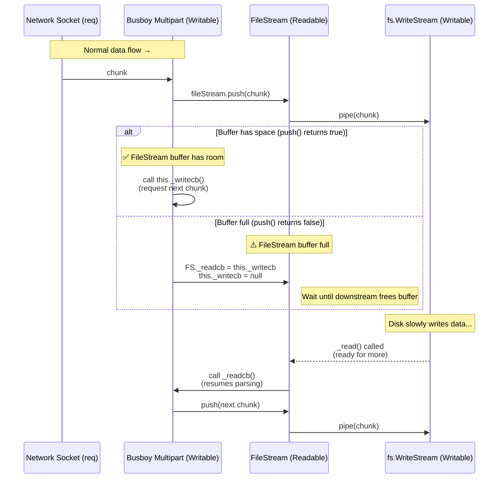

I was recently investigating ways to improve the efficiency of file uploads to a Node.js server. This need arose after encountering a production bug where the absence of a maximum file size limit for uploads led to an out-of-memory crash due to file buffers consuming excessive heap memory. In this Node.js server, I was using Express and `express-openapi-validator` to document the server's API with an `OpenAPI` specification. `express-openapi-validator` utilizes `multer` for file uploads. I had previously encountered this library whenever file uploads from forms needed to be handled in Node.js, but I never questioned why a separate library was necessary for file uploads. This time, I decided to go deeper to understand if a dedicated package for file uploads is truly needed, and if so, what specific benefits `Multer` or similar libraries provide.
I initially needed to find a configuration option in `express-openapi-validator` to set a request-wide limit on the maximum size (in bytes) of data allowed in a request, including all file attachments.  The `express-openapi-validator` package offers a `fileUploader` configuration ([fileUploader documentation](https://cdimascio.github.io/express-openapi-validator-documentation/usage-file-uploader/)) that passes options directly to `multer`.

Therefore, I checked the `multer` documentation and discovered the `limits` configuration option ([multer limits documentation](https://github.com/expressjs/multer?tab=readme-ov-file#limits)), which perfectly suited the needs. `multer` uses `busboy` to handle the parsing of multipart form data in a stream fashion. Consequently, the `limits` options defined in `multer` are actually passed directly to `busboy`, and represent `busboy's` limit configurations.
```md
- **limits** - _object_ - Various limits on incoming data. Valid properties are:
    
- **fieldNameSize** - _integer_ - Max field name size (in bytes). **Default:** `100`.
	
- **fieldSize** - _integer_ - Max field value size (in bytes). **Default:** `1048576` (1MB).
	
- **fields** - _integer_ - Max number of non-file fields. **Default:** `Infinity`.
	
- **fileSize** - _integer_ - For multipart forms, the max file size (in bytes). **Default:** `Infinity`.
	
- **files** - _integer_ - For multipart forms, the max number of file fields. **Default:** `Infinity`.
	
- **parts** - _integer_ - For multipart forms, the max number of parts (fields + files). **Default:** `Infinity`.
	
- **headerPairs** - _integer_ - For multipart forms, the max number of header key-value pairs to parse. **Default:** `2000` (same as node's http module).

```

So, based on the available options, I can have a per-file-based size limit along with a limit on the number of files.  However, that wasn't quite what I needed, since the requirement wasn't just to cap the *number* of files, but to limit the overall request upload size.  Eventually, I stumbled upon [this feature request](https://github.com/mscdex/busboy/issues/367) in the `busboy` repository, which addressed exactly what I wanted.  This discovery kicked off a intresting exploration of how `busboy` handles multipart form data.  It led to uncovering many details regarding **back pressure** in streams, how **TCP control flow windows** help in maintaining back pressure, and all this in an effort to contribute a request-wide total size limit configuration option to `busboy`. 

## Streams in NodeJS

Let's first look at an example usage of `busboy` with plain old HTTP server in Node.js
```js
const http = require('http');

const busboy = require('busboy');

http.createServer((req, res) => {
  if (req.method === 'POST') {
    console.log('POST request');
    const bb = busboy({ headers: req.headers });
    bb.on('file', (name, file, info) => {
      const { filename, encoding, mimeType } = info;
      console.log(
        `File [${name}]: filename: %j, encoding: %j, mimeType: %j`,
        filename,
        encoding,
        mimeType
      );
      file.on('data', (data) => {
        console.log(`File [${name}] got ${data.length} bytes`);
      }).on('close', () => {
        console.log(`File [${name}] done`);
      });
    });
    bb.on('field', (name, val, info) => {
      console.log(`Field [${name}]: value: %j`, val);
    });
    bb.on('close', () => {
      console.log('Done parsing form!');
      res.writeHead(303, { Connection: 'close', Location: '/' });
      res.end();
    });
    req.pipe(bb);
  }
}).listen(8000, () => {
  console.log('Listening for requests');
});
```

Looking at the code, the `req` object (a `Readable` stream) is piped into the `busboy` instance (`bb`). This `bb` instance returns a `MultiPart` class object (specifically, an instance of the class found [here](https://github.com/mscdex/busboy/blob/master/lib/types/multipart.js#L221)), which inherits from `Writable`.

The `Readable` and `Writable` streams have several methods that are invoked at different times during operations such as `read`, `write`, and `pause`. Because each stream relies on the consumer downstream and the producer upstream, Node.js buffers the generated data by default if there's backpressure in the stream pipeline. You can find more information about this in the Node.js [documentation](https://nodejs.org/api/stream.html#buffering): 
> Both [`Writable`](https://nodejs.org/api/stream.html#class-streamwritable) and [`Readable`](https://nodejs.org/api/stream.html#class-streamreadable) streams will store data in an internal buffer.
The amount of data potentially buffered depends on the `highWaterMark` option passed into the stream's constructor. For normal streams, the `highWaterMark` option specifies a [total number of bytes](https://nodejs.org/api/stream.html#highwatermark-discrepancy-after-calling-readablesetencoding). 
Data is buffered in `Readable` streams when the implementation calls [`stream.push(chunk)`](https://nodejs.org/api/stream.html#readablepushchunk-encoding). If the consumer of the Stream does not call [`stream.read()`](https://nodejs.org/api/stream.html#readablereadsize), the data will sit in the internal queue until it is consumed.
Once the total size of the internal read buffer reaches the threshold specified by `highWaterMark`, the stream will temporarily stop reading data from the underlying resource until the data currently buffered can be consumed (that is, the stream will stop calling the internal [`readable._read()`](https://nodejs.org/api/stream.html#readable_readsize) method that is used to fill the read buffer).
Data is buffered in `Writable` streams when the [`writable.write(chunk)`](https://nodejs.org/api/stream.html#writablewritechunk-encoding-callback) method is called repeatedly. While the total size of the internal write buffer is below the threshold set by `highWaterMark`, calls to `writable.write()` will return `true`. Once the size of the internal buffer reaches or exceeds the `highWaterMark`, `false` will be returned.
> 
A key goal of the `stream` API, particularly the [`stream.pipe()`](https://nodejs.org/api/stream.html#readablepipedestination-options) method, is to limit the buffering of data to acceptable levels such that sources and destinations of differing speeds will not overwhelm the available memory.

To understand the idea discussed above in the docs let's take an example:
If your server does something like:
```js
const ws = fs.createWriteStream('file.bin')
req.pipe(ws);
```
Then data flows like this:
```
[TCP socket] → [IncomingMessage (Readable)] → [Writable File Stream] → [disk]
```
But these components run at different speeds:
- The **network producer** (socket) might push data quickly.
- The **file system consumer** might be slower (e.g., disk I/O, file system buffering).
So Node.js stream buffering ensures that:
- The `Readable` (`req`) will stop calling its internal `_read()` once its internal buffer exceeds its `highWaterMark`.
- The `Writable` (`fs.WriteStream`) will signal backpressure by returning `false` from `.write()`, which will pause the `Readable` until the buffer drains.

```
┌────────────────────┐
│   Network Socket   │   (Producer)
│   [TCP Stream]     │
└────────┬───────────┘
         │  data chunks →
         ▼  req.push(chunk)
┌────────────────────┐
│  IncomingMessage   │   (Readable Stream)
│  Internal Buffer   │
│  highWaterMark = 16KB
│  [Buffered: █████░░░░░░] 12KB / 16KB
└────────┬───────────┘
         │  
         │  ws.write(chunk) → called internally after pipe
         ▼
┌────────────────────┐
│  File WriteStream  │   (Writable Stream)
│  Internal Buffer   │
│  highWaterMark = 64KB
│  [Buffered: ████░░░░░░░░] 20KB / 64KB
└────────┬───────────┘
         │  fs.write(chunk)
         ▼
┌────────────────────┐
│     Disk I/O       │   (Slow Consumer)
│  write operation → │
└────────────────────┘
```

As you can see above, if `Disk I/O` is slower than the rate at which we are receiving chunks from the TCP socket, the `ws.write` call will continue buffering incoming chunks into its internal memory buffer until it reaches its `highWaterMark` (64KB in this case). Once the buffer is full, `ws.write` returns `false`, signalling the stream above it that the downstream consumer is slower.
The `IncomingMessage` (`req`), being a readable stream, will then start buffering the chunks coming from the TCP socket in its own internal buffer (16KB `highWaterMark`). When this buffer fills up, `req.push` will also return `false`, indicating it cannot accept more data for now. This backpressure propagates upstream and eventually affects the TCP socket itself, which the OS handles via **TCP flow control** - essentially slowing down the sender to prevent memory overload.

At the OS level, each TCP socket has its own kernel buffer. Normally, data flows like this: 
```
TCP socket kernel buffer → 
user-space buffer → 
writable stream buffer → 
filesystem buffer → 
disk
```
Each step involves memory copies. In some cases, if we don’t need to parse or modify the data (like streaming raw uploads to disk), we can bypass user-space entirely using zero-copy techniques, transferring data directly from the socket kernel buffer to the filesystem kernel buffer. This avoids redundant memory copies and improves performance, at the cost of not being able to inspect or modify the data before it’s written.
For a deeper dive into TCP connections, sockets, and file descriptors, you can check out my detailed write-up [here]().

## `Busboy` Implementation & New Limit Config

Now that we have a basic understanding of how data moves through the `IncomingRequest` object in an HTTP server, let's address the initial question: why do we need Busboy, and what problem does it solve?
Busboy is a parser for `formdata`. We've already seen how we pipe the readable stream `req` output to Busboy's multipart writable stream. Before examining the data flow within Busboy, let's understand `multipart/form-data`.
Below is an example of `multipart/form-data`. We will focus primarily on file uploads for this form, rather than fields.

```
POST /upload HTTP/1.1
Host: example.com
User-Agent: curl/8.0.1
Accept: */*
Content-Type: multipart/form-data; boundary=----WebKitFormBoundary7MA4YWxkTrZu0gW
Content-Length: 512

------WebKitFormBoundary7MA4YWxkTrZu0gW
Content-Disposition: form-data; name="file1"; filename="file1.txt"
Content-Type: text/plain

Hello, this is the content of file1.txt.
It could be multiple lines.
------WebKitFormBoundary7MA4YWxkTrZu0gW
Content-Disposition: form-data; name="file2"; filename="file2.jpg"
Content-Type: image/jpeg

(binary data of file2.jpg would go here)
------WebKitFormBoundary7MA4YWxkTrZu0gW--

```

Breakdown of each part of the above raw HTTP `multipart/form-data` 
1. **HTTP is a text protocol**
    - Everything above is sent as plain text over a TCP connection (except the actual binary file contents).
    - The TCP stream is just a stream of bytes; it has no understanding of **fields** or **files.**
    - **Node.js’s HTTP server reads this TCP stream and parses the start-line and headers** (e.g., `POST /upload HTTP/1.1`, `Host`, `Content-Type`, `Content-Length`) so it can understand the request.
    - After the headers are parsed, the remaining bytes (the body) are exposed to `req` (`IncomingMessage`) as a readable stream.
    - This raw body byte stream is exactly what gets pushed into Busboy for parsing.
2. **Boundary markers**
    - The `boundary` string (`----WebKitFormBoundary7MA4YWxkTrZu0gW`) separates each part of the multipart request.
    - Each part starts with `--<boundary>` and the whole request ends with `--<boundary>--`.
    - Busboy parses these boundaries to identify where one field ends and another begins.
3. **Headers for each part**
    - `Content-Disposition` gives the field name and filename.
    - `Content-Type` tells the server what type of data is being sent.
    - **These headers are part of the raw text stream**; without parsing them, the server cannot know the field names or file types.
4. **Content / File data**
    - Text files are just plain text; binary files are raw bytes included inline in the TCP stream.
    - Node.js or any HTTP server cannot automatically separate the files from the TCP stream.
    - **Busboy (or similar parser) is required to convert this raw text+binary stream into usable file streams or buffers in user space.**
    - This is why a **kernel -> user-space memory copy** is necessary: the server must access the bytes in user-space to parse headers, boundaries, and file contents.
5. **Content-Length**
    - Represents the total bytes of all boundaries, headers, and file data.
    - TCP itself only cares about sending bytes; the HTTP layer interprets them according to this length.

### How Busboy Parses the Multipart Stream
The above raw stream of data is what gets piped to Busboy’s internal `Multipart` writeable stream.
Inside its constructor, Busboy initializes various `limits` based on the configuration provided. As part of the constructor logic, it creates a `HeaderParser` and sets up a [StreamSearch](https://github.com/mscdex/streamsearch) instance with the multipart boundary string as the _needle_:
```js
this._bparser = new StreamSearch(`\r\n--${boundary}`, ssCb);
```
`StreamSearch` calls the given callback `ssCb` whenever it encounters non-matching data or finds a match for the needle.  
In other words, as the raw `multipart/form-data` byte stream flows through, `StreamSearch` helps separate the actual boundaries from the data chunks in between, and passes those chunks to the provided callback for processing.
The callback `ssCb` is the core of the multipart parsing logic. During initialization, Busboy sets up several internal tracking variables, such as:
- **`fileSize`** -  Tracks the size of the current file in bytes across all incoming chunks for that file. Once this reaches the configured `limits.fileSize`, Busboy stops processing additional chunks for that specific file and skips them until it encounters the next boundary (i.e., the start of a new field).
- **`files`** - Keeps track of the number of files seen so far. Once this count reaches `limits.files`, Busboy skips all subsequent file data until it detects the end of the form-data.
There are other similar limits and tracking variables initialized internally, but these two are the most relevant to the new feature we want to add:

> **A global total file size limit across all uploaded files.**  
> For example, if the limit is 50 MB, Busboy should process data only until the total size of all uploaded files reaches 50 MB. After that, it should skip any further chunks - even those belonging to new files - until it reaches the end of the form-data stream.

To implement this, we’ll maintain a running counter similar to `fileSize`, but instead of resetting it per file, we’ll keep accumulating the total bytes processed across all files. Once it reaches `limits.totalFileSize`, we stop processing any further chunks for all files

For each segment identified by `ssCb`, the `HeaderParser` is invoked to inspect the `Content-Disposition` header. From this header, Busboy determines whether the part represents a regular form field or a file upload. If it’s a file, the `filename` is extracted, and the `files` counter is incremented.

As long as the number of processed files remains below `limits.files`, Busboy creates a new `Readable` stream for that file and emits a `file` event. This event carries both the file metadata and the associated stream, allowing your application to handle the file data as it arrives; for example, by piping it directly to a file or cloud storage.

```js
const hparser = new HeaderParser((header) => {
// ... 
// ...
if (files === filesLimit) {
	if (!hitFilesLimit) {
		hitFilesLimit = true;
		this.emit('filesLimit');
	}
	skipPart = true;
	return;
}

fileSize = 0;
this._fileStream = new FileStream(fileOpts, this);

this.emit(
  'file',
  partName,
  this._fileStream,
  { filename,
	encoding: partEncoding,
	mimeType: partType }
);
// ...
// ...
});


// At the other end we can listen to the `file` event on busboy instance
 bb.on('file', (name, file, info) => {
  const saveTo = path.join(os.tmpdir(), `busboy-upload-${random()}`);
  file.pipe(fs.createWriteStream(saveTo));
});
```

When the `file` event is triggered, the listener receives the stream of decoded file data - meaning by this point, the raw multipart byte stream from the TCP socket has been parsed and separated into meaningful file chunks by `Busboy's` internal `StreamSearch` and header parsing logic.
We can also see that when the file limit is reached, Busboy sets a boolean flag `hitFilesLimit` and emits the `filesLimit` event **exactly once** on the Busboy instance. This ensures that the user is notified only the first time the limit is exceeded.
In addition, `skipPart` is set to `true`. This flag tells the parser to **ignore the rest of the current part’s body** after finishing header parsing. Essentially, once we know we’ve hit the maximum number of allowed files, Busboy continues scanning the incoming stream but skips over any additional file data until it encounters the next boundary.
If the `limits.files` threshold has **not** been reached, the parser continues reading the body of the current file. For every incoming chunk of data, it updates the `fileSize` variable and ensures that only data up to the configured `fileSizeLimit` is passed downstream. Any excess bytes are truncated and trigger a `limit` event on the file stream.
Here’s the corresponding section of code that handles this logic:
```js
if (!skipPart) {
  if (this._fileStream) {
	let chunk;
	const actualLen = Math.min(end - start, fileSizeLimit - fileSize);
	if (!isDataSafe) {
	  chunk = Buffer.allocUnsafe(actualLen);
	  data.copy(chunk, 0, start, start + actualLen);
	} else {
	  chunk = data.slice(start, start + actualLen);
	}

	fileSize += chunk.length;
	if (fileSize === fileSizeLimit) {
	  if (chunk.length > 0)
		this._fileStream.push(chunk);
	  this._fileStream.emit('limit');
	  this._fileStream.truncated = true;
	  skipPart = true;
	} else if (!this._fileStream.push(chunk)) {
	  if (this._writecb)
		this._fileStream._readcb = this._writecb;
	  this._writecb = null;
	}
}
```

The important part here is that the **`limit` event** is fired only on the individual `FileStream` instance, not on the `Busboy` instance. This means the event listener attached to that particular file stream (usually through the `'file'` event handler on `Busboy`) can detect that the stream has been truncated because its size exceeded the per-file limit.

>With our new **`totalFileSize`** feature, however, we’ll extend this behavior,  A new event:  `totalSizelimit` event will be fired on **both** the `FileStream` and the **Busboy instance**. This is because exceeding the `totalFileSize` means the current file is truncated **and** no further file data across the entire request should be processed. The event now serves as a global signal to stop consumption of further reads as there won't be any more data parsed and pushed to the stream by `busboy` because of limits. 

### `Busboy's` Back pressure Handling
If you look closely at the snippet above, you’ll also notice something interesting about how `Busboy` handles **backpressure**.
When `this._fileStream.push(chunk)` returns **`false`**, it means that **the internal buffer of the `Readable` stream (`_fileStream`) itself is full**, and therefore it’s temporarily unable to accept more data from its upstream producer: In this case, `Busboy’s` `Multipart` writable stream.
Here’s the nuance:
- The `FileStream` class in `Busboy` is a **custom `Readable` stream** that emits the parsed file data.
- `Busboy` (the `Multipart` writable) acts as the **producer** of that readable stream’s data.
- When `Busboy` calls `fileStream.push(chunk)`:
    - If it returns `true`, it means the file stream’s internal buffer still has room it’s safe to push more data.
    - If it returns `false`, the file stream’s internal `highWaterMark` is reached  meaning it’s now buffering as much data as it can before its _slow consumer_ (e.g., `fs.createWriteStream`) reads more.
That **“slow consumer”** can be anything on the other end of the pipe:
- a file write stream (disk I/O delay),
- a transform stream (CPU-bound operation),
- or even network latency if you’re piping it to another request.

To handle this gracefully, **Busboy performs a clever trick**. When the file stream’s internal buffer is full (`push()` returns `false`), Busboy **temporarily saves** its `_writecb` -  the callback passed by Node.js’ `Writable` stream to signal readiness for the next chunk - into the file stream’s `_readcb` property, and then sets `_writecb = null`.

Let’s see where this `_writecb` comes from in the first place:

```js
_write(chunk, enc, cb) {
	this._writecb = cb;
	this._bparser.push(chunk, 0);
	if (this._writecb)
	  callAndUnsetCb(this);
}
```

This `_write()` method belongs to the `Multipart` class, which extends Node’s `Writable` stream.  
It’s invoked automatically when the incoming `request’s` readable stream (for example, `req`) is piped into the `Busboy` instance like this:
```js
req.pipe(bb);
```

Here, the `cb` parameter in `_write` method represents Node’s **backpressure callback**.  
Calling this callback tells Node.js, 
> “I’m done processing this chunk, You can send me the next one.”

By saving `cb` into `this._writecb`, Busboy is essentially saying:

> “Hold on, I’ll call this callback later, once I’m sure it’s safe to receive more data after parsing current chunk.”

Now, when the file stream slows down (because its internal buffer is full), Busboy **hands off** this `_writecb` to the file stream by assigning it to `_readcb`.  
This is a crucial step: *it ties the writable side (Busboy) and the readable side (`FileStream`) together through deferred signalling.*
Later, when the consumer, Say, an `fs.WriteStream` writing to disk finishes processing some data and is ready for more, it triggers the `FileStream`’s `_read()` method:
```js
_read(n) {
	const cb = this._readcb;
	if (cb) {
	  this._readcb = null;
	  cb();
	}
}
```

This is where the “**magic**” happens.  
That previously saved callback (`cb`), which originally came from the *writable* side (`Busboy`), is now invoked by the readable side (`FileStream`).  
**This signals back upstream that the consumer has caught up and Busboy can safely resume parsing and pushing more data.**



In essence, this **handoff of callbacks between `_writecb` and `_readcb`** is Busboy’s internal mechanism for **propagating backpressure**.  
It ensures that data flows smoothly from 
The `req` (the network socket and `IncomingMessage` readable) → 
into Busboy’s `Multipart` writable →
Through the `FileStream` readable →
And finally into the consumer `writable` (like the `filesystem`)
All without overwhelming any part of the chain.

## Wrapping Up

This exploration of how Busboy parses multipart form data, manages `backpressure`, and coordinates between readable and writable streams gave me a much deeper understanding of Node.js stream internals.

As part of this deep dive, As I mentioned, I also proposed a small improvement to `Busboy` — **adding support for a `totalFileSize` limit** that stops processing once the total upload size crosses a configured threshold. You can check out the implementation for more details about the change here:  
🔗 **[GitHub PR #374 – Add total file size limit support in Busboy](https://github.com/mscdex/busboy/pull/374/files)**
